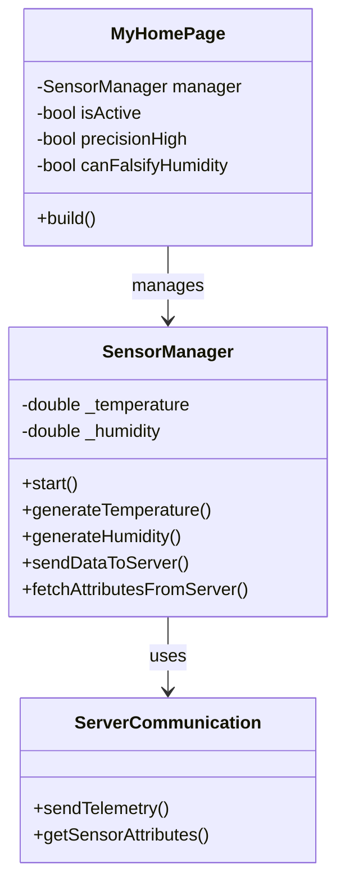
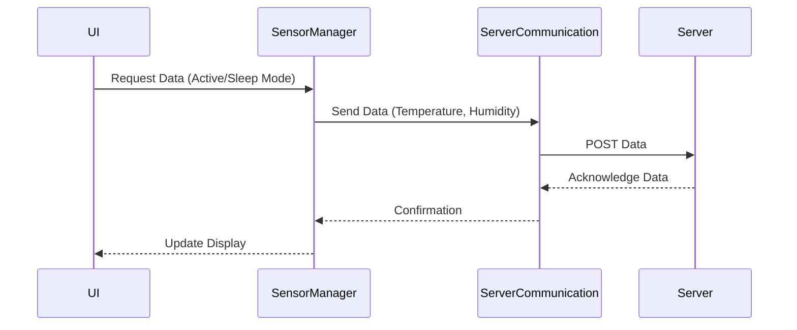
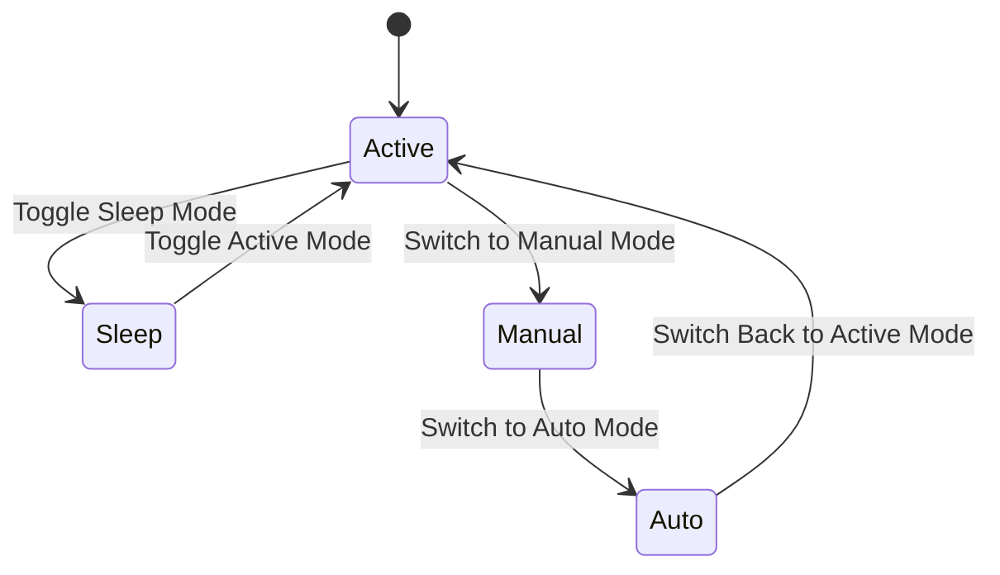

<!-- SPDX-FileCopyrightText: 2025 Daniel ETEME  <deteme.ir2026@esaip.org> -->
<!-- SPDX-License-Identifier: MIT -->

# Temperature & Humidity Monitoring System Documentation

## 1. Introduction

This project is a Flutter-based simulation of an sensor. It replicates a temperature and humidity sensor that periodically sends telemetry data to a server. The application focuses on flexibility, allowing both automated and manual data handling, with configurable settings for precision and operational mode. It also includes a simple UI for real-time interaction and attribute display, closely mimicking real-world IoT behavior.

### Core Features
- Periodical send of temperature and humidity values to a server either **automatically** or **manually** in two modes(**active mode** & **sleep mode**).
  - In **active mode**, temperature is sent every 10 seconds, humidity every 20 seconds.
  - In **sleep mode**, temperature is sent every 20 seconds, humidity every 50 seconds.
- Support for **manual** data input via the GUI:
  - Temperature can be set manually with a precision of 0.1°C and respecting the range of 0°C to 50°C.
  - Humidity can be set manually with a precision of 1% respecting the range of 0% to 100%.
- Data sent to the server is always in Celsius for temperature and in percentage for humidity.
- The GUI displays the temperature unit configured on the server.
- Includes a mode switch button in the GUI to toggle between active and sleep modes.


---

## 2. System Architecture

### 2.1 Component Diagram



### 2.2 Data Flow

1. The UI allows toggling precision, falsification, and active/sleep mode.
2. `SensorManager` generates data and manages timers.
3. `ServerCommunication` handles data transmission to and from the server.
4. The app periodically fetches updated attributes from the server.

---

## 3. Technical Specifications

| Component              | Details                            |
|------------------------|------------------------------------|
| Framework              | Flutter                            |
| Language               | Dart                               |
| Platform               | Android                            |
| Architecture           | MVC-like                           |
| Main Files             | `main.dart`, `sensor_manager.dart`, `sensor.dart`, `server_communication.dart`, `constants.dart`, `functions.dart` |
| Key Packages           | `http: ^1.1.0`                     |
| Transmission Frequency | Temp: 10s (active), 20s (standby)<br>Humidity: 20s (active), 50s (standby) |

---

## 4. Core Components

### 4.1 `main.dart`

Main entry point with `MyApp` and `MyHomePage`. Manages the UI and user interactions:

- Displays current temperature and humidity values.
- Includes 2 **ElevatedButtons**:
  - Mode switch (**Active**/**Sleep** mode)
  - Data mode switch (**Automatic**/**Manual** sending)
- When manual mode is activated:
  - Enables temperature and humidity falsification fields with their respective update buttons (precision: 0.1°C and 1%)
- Updates the UI when the `SensorManager` provides new data.

---

### 4.2 `sensor_manager.dart`

Handles the simulation logic, modes, and server communication.

**Responsibilities:**
- Generates temperature and humidity values automatically in auto mode.
- Handles manual input updates in manual mode.
- Starts/stops timers depending on active/sleep mode.
- Sends temperature and humidity data to the server at the correct intervals.
- Triggers UI updates through a provided callback.

**Key Method:**
```dart
void start({required Function onUpdate}) {
  _startTimers(onUpdate);
}
```

---

### 4.3 `sensor.dart`

Defines the sensor data model with serialization capabilities(converting data between object ↔ JSON format for server communication).

**Key Features**:
- Stores device data (ID, name, type)
- Contains client/server configuration attributes
- Tracks telemetry data (temperature/humidity)
- Supports JSON serialization/deserialization

**Core Methods**:
```dart
factory Sensor.fromJson()  // Creates from JSON
toJson()                 // Converts to JSON
toString()              // Debug-friendly output
```

**Data Structure**:
```dart
{
  "id": "1",
  "name": "Temperature Sensor",
  "type": "temperature_sensor",
  "clientAttributes": {"Serial Number": "TS-001"},
  "serverAttributes": {"Location": "Living Room"},
  "telemetryData": {"temperature": "0.0", "humidity": "0.0"}
}
```

---

### 4.4 `server_communication.dart`

Handles all server communication for sensor data transmission.

**Key Features**:
- Sends structured telemetry data via POST requests
- Includes error handling for network issues
- Attaches timestamp to all transmissions

**Core Method**:
```dart
static Future<void> sendDataToServer(
  Sensor sensor,       // Device info
  double temperature,  // Current reading
  double humidity      // Current reading
) async
```

**Data Structure**:
```json
{
  "sensor": { /* Full sensor object */ },
  "temperature": 22.5,
  "humidity": 48.0,
  "timestamp": "ISO-8601 format"
}
```

**Error Handling**:
- Catches both HTTP errors (status codes) and network exceptions
- Logs errors to console


---

### 4.5 `constants.dart`

Stores global application constants:

**Key Values**:
- `THING_API_URL`: Server API base URL  
- `sensorTypes`: Supported device configurations  
  ```dart
  [
    {"type": "temperature_sensor", "name": "Capteur de température"},
    {"type": "my_thing", "name": "Maison domotique"}
  ]
---

### 4.6 `functions.dart`

Provides utility functions for data generation:

**Key Functions**:
- `generateTemperature(int precision)`  
  → Creates random temperature (0-50°C) with specified decimal precision
- `generateRandomString(int length)`  
  → Generates alphanumeric strings for IDs/tokens


---

## 5. Application Behavior

**Dual Toggle System**:

1. **Active/Sleep Mode**:
   - Active: Temperature (10s), Humidity (20s) intervals
   - Sleep: Temp (20s), Humidity (50s) intervals

2. **Auto/Manual Mode**:
   - Auto: Generates random values
   - Manual: Allows precise input (0.1°C temperature, 1% humidity)

**Key Behavior**:
- Seamless mode combinations (e.g., Active+Manual)
- Input fields auto-disable in Auto mode
- Instant UI feedback on toggle
---


## 6. User Guide

### 6.1 How to Run
```bash
flutter pub get
flutter run
```

### 6.2 Interface Overview
- **Live Data Display**: Shows current temperature (0.1°C precision) and humidity (1% precision)
- **Mode Controls**:
  - Active/Sleep toggle (changes transmission intervals)
  - Auto/Manual toggle (enables/disables input fields)

###
  - 
*(`main screen in auto mode with disabled textfields`)*

###
  -  
*(`main screen in manual mode with enabled textfiels`)*

---

## 7. Testing

| Test Case                | Verification Point                     |
|--------------------------|----------------------------------------|
| Switch to Sleep Mode     | Temp updates every 20s, Humidity 50s  |
| Enable Manual Mode       | Input fields become interactive        |
| Submit Invalid Temp      | Rejects non-numeric input              |
| Server Disconnected      | Logs error without crashing           |

---

## 8. Diagrams

### 8.1 Data Flow


### 8.2 Mode States


---

## 9. File Structure
```
lib/
├── main.dart              # UI and controls
├── managers/              # Business logic
│   └── sensor_manager.dart
├── models/                # Data structures
│   └── sensor.dart
├── services/              # Server communication
│   └── server_communication.dart
├── utils/                 # Utilities
│   ├── constants.dart
│   └── functions.dart
```

---

## 10. Future Improvements
1. Interactive Charts
2. Notifications when values exceed thresholds

---

## 11. Conclusion
This application demonstrates:
- Clean state management
- Precise sensor simulation
- Robust error handling
- Modular architecture

---


**License**: MIT  
© 2025 Daniel ETEME

