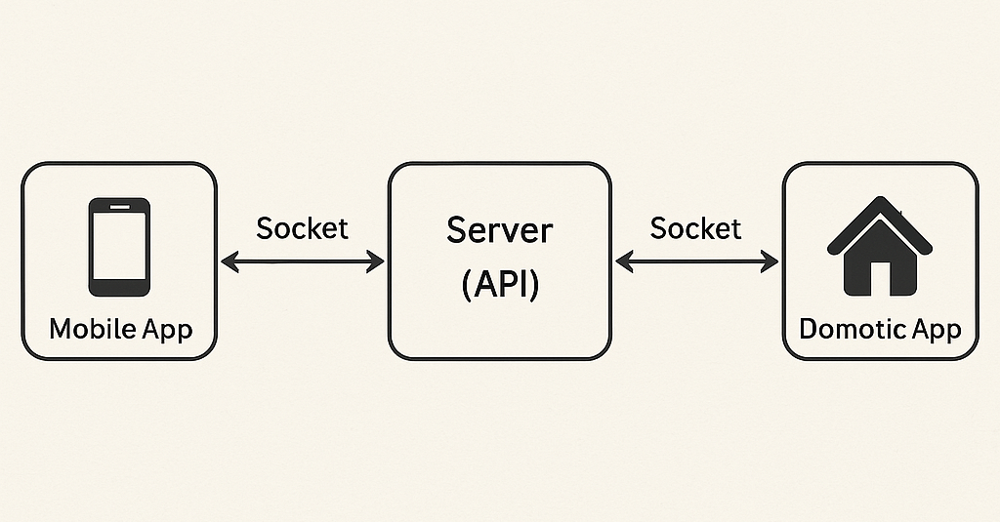
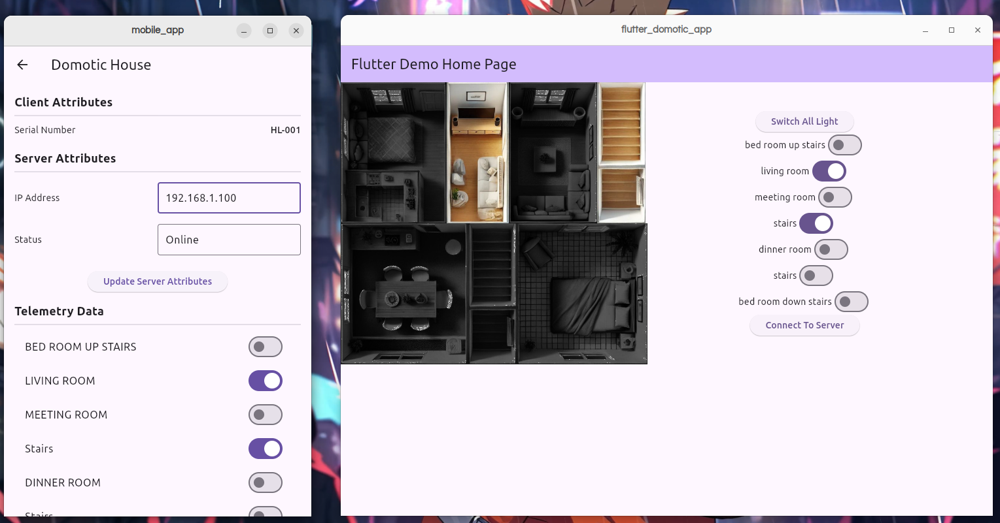

# 🏠 **Domotic House Simulation - Documentation Plan**

## Summary

1. **Introduction**
2. **Features**
3. **Architecture Overview**
4. **Installation & Setup**
5. **Screenshots / Demo (Optional)**
8. **Future Improvements (Optional)**


## 1. **Introduction**
The domotic application is an application developped in the context of a class's project. The main goal was to simulate the behavior of a connected object and make accessible is feature through a mobile app.
This application simulate a domotic house where the user can turn on and off light in each room individually or in the whole house.

## 2. **Features**
The main Features are :
  - A visual representation of the house : The application display a consistant representation of the house to the user so that he can see the different rooms.
  - Turn lights on/off : The user is able to turn lights in the house.
  - Room-specific control : The user is able to turn on and off the light in any room individually without affection the oder room.
  - House Remote control : The user is able to interact whith the house throught a mobile application (Android or IOS) developped alongside.
  - Real-time UI updates : If the user use the mobile application to interact with the house, the reaction of his action must be seen in real time in the house representation.
 

## 3. **Architecture Overview**
- **Technologies Used**: The application is written in dart with the framework flutter.
- **Structure**: The application consist on a windows that maintains a communication with an API (developped alongside) through socket communication to insure realtime information exchange. Below is a schema of representing the structure of the project. Below is a figure showing the communicaiton between the differents components.



## 4. **Installation & Setup**
Step-by-step guide to run the project:
  - Prerequisites : install flutter SDK in your development environment.
  - Clone repository the three repository involved : 
    - [The domotic app](https://github.com/Folley-05/flutter-domotic-appc)
    - [The server ](https://github.com/Folley-05/flutter-server-app)
    - [The mobile app](https://github.com/ronylkemamen/flutter-mobile-app)

    ```
    git clone https://github.com/Folley-05/flutter-domotic-app.git
    git clone https://github.com/Folley-05/flutter-server-app.git
    git clone https://github.com/ronylkemamen/flutter-mobile-app.git
    ```

    <u>**PS :**</u> You can clone just the domotic app if you only want to play around with his feature. You will be able to turn on and off lights but keep in mind that wo communication will be established
  - Install dependencies contained in the pubspec.yaml
  - Run the different projects

## 5. **How to Use**
Here is a walkthrough on how to make work the whole project:
  - Launch the server and make sur there is an API running on port 3000 and 3001. You can navigate to http://localhost:3000/api/v1/hello and http://localhost:3000/api/v1/hello to make sure make sure it has launched well. You should receive a text message for each url.
  - Launch the domotic app and once the screen is loaded click connect to the server.
  - Lauch the mobile app and wait till a thing of type "domotic_type" appears on the screen. The mobile app look for connection to the server instantly.
  - Select the house and use the switch the turn on and off the lights.

## 6. **Screenshots / Demo (Optional)**
Here are screen shots of the application once all is connected well.




## 7. **Known Issues / Limitations**
The actual system has the following issues :
- Lack of feedback when connection to the server fail
- The stage of the house is not conserved between reload

## 8. **Future Improvements (Optional)**
Suggestions for what could be added next:
  - Add feed back message to inform the user of what is going on on the applicaiton.
  - Give the possibility to add house and add room in an house.
  - Add automatic action like turning on and off light according to the hour.
  - Add a user authentication.